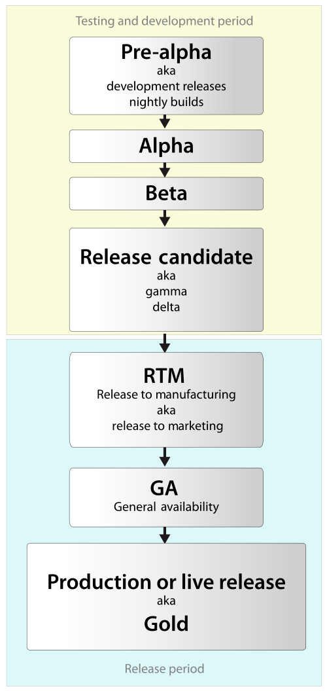

# Boros
Amateur rocket created by an 15 year old teenager

## Pre-Alpha!
*Pre-alpha refers to all activities performed during the software project before formal testing. These activities can include requirements analysis, software design, software development, and unit testing. In typical open source development, there are several types of pre-alpha versions. Milestone versions include specific sets of functions and are released as soon as the feature is complete.*

