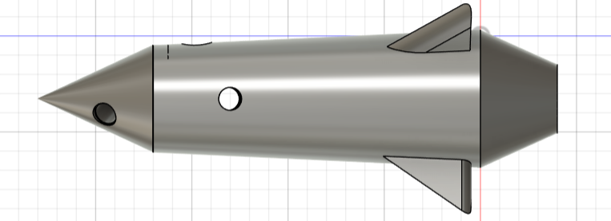
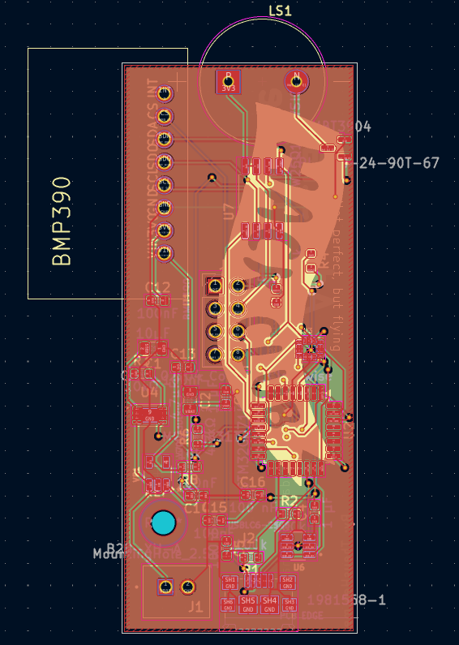
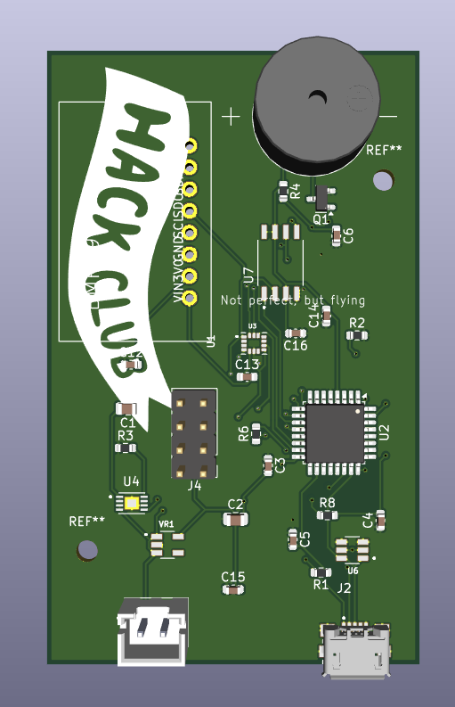
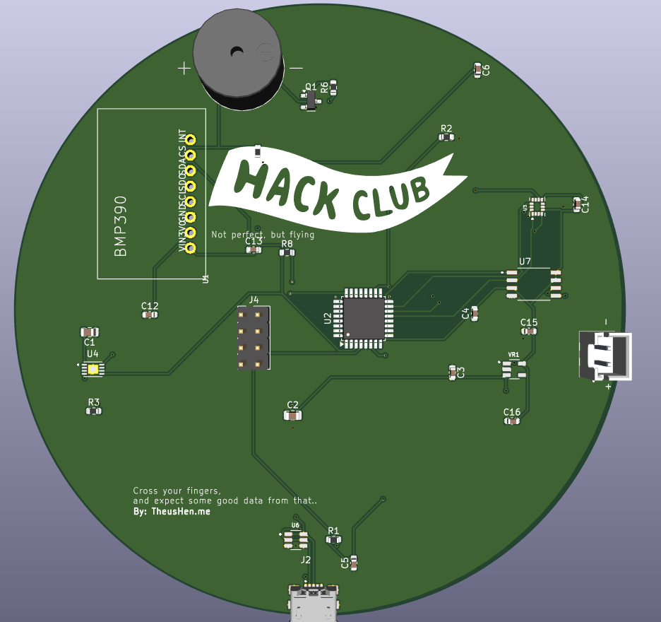
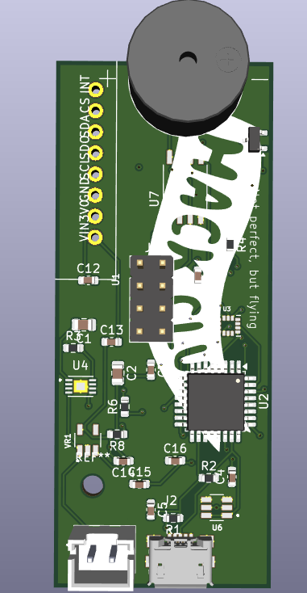
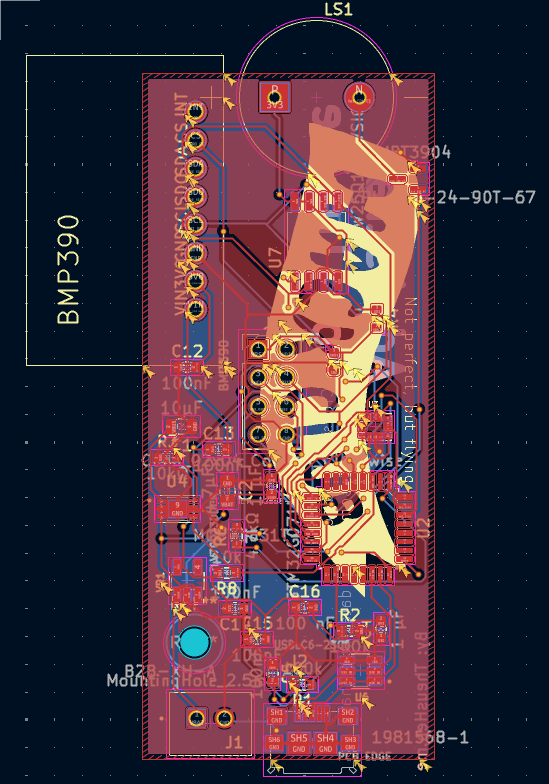

# Boros Rocket

*Amateur rocket created by an 15 year old teenager.*



This repository contains the current **Beta** state of the Boros rocket avionics stack.  
The project has already passed **Pre-Alpha** and **Alpha** stages and is now focused on stabilizing hardware-software integration with the **Plate PCB version**.

## Current Focus

- Firmware flight logging and fault handling (`firmware/`)
- Physics-based flight simulation and Monte Carlo (`sim/flight/`)
- PCB design and manufacturing outputs (`PCB/plate_version/`)
- CI pipeline with firmware build, simulation, and reporting (`.github/workflows/ci.yml`)

## Hardware Direction (Plate Version)

We are using the **Plate PCB** approach (not the Coin version), currently at **V4 (2 layers)**.

### PCB and 3D previews




### PCB iteration history (Plate)






## Mass Budget Baseline (Plate)

The mass budget tool is used to estimate liftoff mass from:

- Rocket 3D model volume
- Motor mass: **24.1 g**
- PCB plate geometry: **25 mm x 62 mm**, **2 copper layers**
- Motor limit check: **113 g max liftoff mass**

Run:

```bash
make python-mass-budget
```

Outputs:

- `sim/flight/out/mass_budget.json`
- `sim/flight/out/mass_budget.md`

## Simulation Workflow

The Python simulation now consumes the mass budget output and uses the suggested total mass automatically.

Run:

```bash
make python-sim
```

This generates:

- Flight timeseries and summary
- Monte Carlo summary
- Firmware-like sensor log for playback/testing

## Quick Commands

```bash
make firmware
make python-check
make python-sim
make python-firmware-playback
make python-mass-budget
```

## Notes

- The repository includes both firmware and simulation assets to support rapid iteration.
- CI publishes simulation and firmware validation artifacts for each run.
